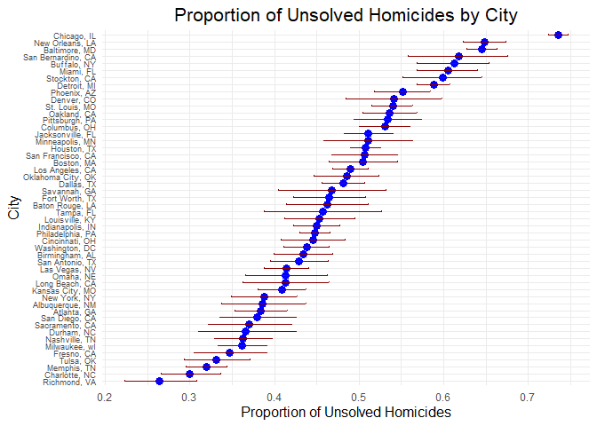

p8105_hw5_fl2714
================
Fangchi
2024-11-10

``` r
library(dplyr)
```

    ## 
    ## 载入程序包：'dplyr'

    ## The following objects are masked from 'package:stats':
    ## 
    ##     filter, lag

    ## The following objects are masked from 'package:base':
    ## 
    ##     intersect, setdiff, setequal, union

``` r
library(readr)
library(broom)
library(purrr)
library(tidyr)
library(ggplot2)
library(tidyverse)
```

    ## ── Attaching core tidyverse packages ──────────────────────── tidyverse 2.0.0 ──
    ## ✔ forcats   1.0.0     ✔ stringr   1.5.1
    ## ✔ lubridate 1.9.3     ✔ tibble    3.2.1

    ## ── Conflicts ────────────────────────────────────────── tidyverse_conflicts() ──
    ## ✖ dplyr::filter() masks stats::filter()
    ## ✖ dplyr::lag()    masks stats::lag()
    ## ℹ Use the conflicted package (<http://conflicted.r-lib.org/>) to force all conflicts to become errors

### Question 2

``` r
set.seed(1)
n <- 30       
sigma <- 5    
alpha <- 0.05 
mu_value <- 0  
num_simulations <- 5000

sim_mean_sd <- function(n, mu = 0, sigma = 5) {
  x <- rnorm(n, mean = mu, sd = sigma)
  tibble(
    mu_hat = mean(x),
    sigma_hat = sd(x)
  )
}

sim_results <- map_df(1:num_simulations, ~ sim_mean_sd(n, mu = mu_value, sigma = sigma))

head(sim_results)
```

    ## # A tibble: 6 × 2
    ##   mu_hat sigma_hat
    ##    <dbl>     <dbl>
    ## 1  0.412      4.62
    ## 2  0.664      3.98
    ## 3  0.551      4.80
    ## 4  0.567      4.41
    ## 5 -1.65       4.61
    ## 6  1.19       5.28

### Question 3

#### 1. Describe raw data

``` r
# Read data
homicide_data <- read_csv("data/homicide-data.csv",show_col_types = FALSE)

# Create a city_state variable
homicide_data <- homicide_data %>%
  mutate(city_state = paste(city, state, sep = ", "))

# Summarize total and unsolved homicides per city
city_summary <- homicide_data %>%
  group_by(city_state) %>%
  summarize(
    total_homicides = n(),
    unsolved_homicides = sum(disposition %in% c("Closed without arrest", "Open/No arrest"))
  ) %>%
  filter(total_homicides >= 5)
```

#### 2. Baltimore data

``` r
# Filter for Baltimore data
baltimore_data <- city_summary %>%
  filter(city_state == "Baltimore, MD")

# Perform proportion test
prop_test_baltimore <- prop.test(
  baltimore_data$unsolved_homicides,
  baltimore_data$total_homicides
)

# Use broom to tidy the results
baltimore_test_summary <- tidy(prop_test_baltimore)

# Pull out the proportion estimate and confidence intervals
baltimore_proportion <- baltimore_test_summary$estimate
baltimore_ci <- c(baltimore_test_summary$conf.low,baltimore_test_summary$conf.high)
```

#### 3. prop.test for each of the cities

``` r
# Run prop.test for each city
city_test_results <- city_summary %>%
  mutate(
    prop_test = map2(unsolved_homicides, total_homicides, ~ prop.test(.x, .y)),
    prop_summary = map(prop_test, tidy)
  ) %>%
  unnest(prop_summary) %>%
  select(city_state, estimate, conf.low, conf.high)
```

#### 4. Create a plot that shows the estimates and CIs for each city

``` r
city_test_results <- city_test_results %>%
  arrange(estimate) %>%
  mutate(city_state = factor(city_state, levels = city_state))

ggplot(city_test_results, aes(x = city_state, y = estimate)) +
  geom_point(color = "blue", size = 3) +  
  geom_errorbar(aes(ymin = conf.low, ymax = conf.high), width = 0.2, color = "darkred", linewidth = 0.5) +  
  coord_flip() +  
  labs(
    title = "Proportion of Unsolved Homicides by City",
    x = "City",
    y = "Proportion of Unsolved Homicides"
  ) +
  theme_minimal() +
  theme(
    plot.title = element_text(hjust = 0.5, size = 16),  
    axis.text.y = element_text(size = 7),  
    axis.title = element_text(size = 12)  
  )
```

<!-- -->
