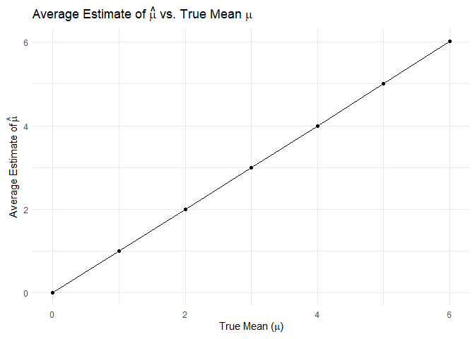

p8105_hw5_fl2714
================
Fangchi
2024-11-10

``` r
library(dplyr)
```

    ## 
    ## 载入程序包：'dplyr'

    ## The following objects are masked from 'package:stats':
    ## 
    ##     filter, lag

    ## The following objects are masked from 'package:base':
    ## 
    ##     intersect, setdiff, setequal, union

``` r
library(readr)
library(broom)
library(purrr)
library(tidyr)
library(ggplot2)
library(tidyverse)
```

    ## ── Attaching core tidyverse packages ──────────────────────── tidyverse 2.0.0 ──
    ## ✔ forcats   1.0.0     ✔ stringr   1.5.1
    ## ✔ lubridate 1.9.3     ✔ tibble    3.2.1

    ## ── Conflicts ────────────────────────────────────────── tidyverse_conflicts() ──
    ## ✖ dplyr::filter() masks stats::filter()
    ## ✖ dplyr::lag()    masks stats::lag()
    ## ℹ Use the conflicted package (<http://conflicted.r-lib.org/>) to force all conflicts to become errors

### Question 2

``` r
set.seed(1)
n <- 30       
sigma <- 5    
alpha <- 0.05 
mu_values <- c(0, 1, 2, 3, 4, 5, 6)  
num_simulations <- 5000

# Function to generate dataset, perform t-test, and extract results using broom::tidy
sim_mean_sd <- function(n, mu = 0, sigma = 5) {
  x <- rnorm(n, mean = mu, sd = sigma)
  t_test <- t.test(x, mu = 0)
  tidy(t_test) %>%
    mutate(mu_hat = mean(x))
}

# Run simulations for each mu value
sim_results <- map_df(mu_values, function(mu_value) {
  map_df(1:num_simulations, ~ sim_mean_sd(n, mu = mu_value, sigma = sigma)) %>%
    mutate(mu = mu_value)
})

# Calculate power for each mu value (proportion of tests where null was rejected)
power_results <- sim_results %>%
  group_by(mu) %>%
  summarise(power = mean(p.value < alpha))
```

``` r
# Plot 1 with expression for mu symbol
ggplot(power_results, aes(x = mu, y = power)) +
  geom_line() +
  geom_point() +
  labs(
    title = expression("Power vs. Effect Size (True Mean " * mu * ")"),
    x = expression("True Mean (" * mu * ")"),
    y = "Power (Proportion of Null Rejections)"
  ) +
  theme_minimal()
```

<!-- -->

``` r
# Calculate the average of mu_hat for each mu value
avg_mu_hat <- sim_results %>%
  group_by(mu) %>%
  summarise(avg_mu_hat = mean(mu_hat))

# Plot 2: Average Estimate of mu_hat vs. True Mean (µ) with expression
ggplot(avg_mu_hat, aes(x = mu, y = avg_mu_hat)) +
  geom_line() +
  geom_point() +
  labs(
    title = expression("Average Estimate of " * hat(mu) * " vs. True Mean " * mu),
    x = expression("True Mean (" * mu * ")"),
    y = expression("Average Estimate of " * hat(mu))
  ) +
  theme_minimal()
```

<!-- -->

``` r
# Calculate the average of mu_hat only for tests where null was rejected
avg_mu_hat_rejected <- sim_results %>%
  filter(p.value < alpha) %>%
  group_by(mu) %>%
  summarise(avg_mu_hat_rejected = mean(mu_hat))

# Average Estimate of µ̂ for Rejected Tests vs. True Mean (µ)
ggplot(avg_mu_hat, aes(x = mu, y = avg_mu_hat)) +
  geom_line(color = "blue", linetype = "dashed") +
  geom_point(color = "blue") +
  geom_line(data = avg_mu_hat_rejected, aes(x = mu, y = avg_mu_hat_rejected), color = "red") +
  geom_point(data = avg_mu_hat_rejected, aes(x = mu, y = avg_mu_hat_rejected), color = "red") +
  labs(title = "Average Estimate of µ̂ vs. True Mean µ (Overall and Rejected Tests)",
       x = expression("True Mean (" * mu * ")"),
       y = "Average Estimate of µ̂") +
  theme_minimal() +
  scale_color_manual(values = c("Overall" = "blue", "Rejected" = "red"))
```

    ## Warning: No shared levels found between `names(values)` of the manual scale and the
    ## data's colour values.

<!-- -->

the sample average of miu across tests where the null is rejected is not
approximately equal to the true miu due to selection bias. By
conditioning on rejection of the null, we are choosing samples where the
observed effect is more extreme, leading to an overestimation of the
true mean miu in the subset of rejected tests.

### Question 3

#### 1. Describe raw data

``` r
# Read data
homicide_data <- read_csv("data/homicide-data.csv",show_col_types = FALSE)

# Create a city_state variable
homicide_data <- homicide_data %>%
  mutate(city_state = paste(city, state, sep = ", "))

# Summarize total and unsolved homicides per city
city_summary <- homicide_data %>%
  group_by(city_state) %>%
  summarize(
    total_homicides = n(),
    unsolved_homicides = sum(disposition %in% c("Closed without arrest", "Open/No arrest"))
  ) %>%
  filter(total_homicides >= 5)
```

The `homicide_data` dataset contains 52179 rows and 13 columns. It
includes information on victims’ demographics, homicide locations, and
case status (such as date and disposition), which enable us to
investigate patterns and trends in homicide cases.

#### 2. Baltimore data

``` r
# Filter for Baltimore data
baltimore_data <- city_summary %>%
  filter(city_state == "Baltimore, MD")

# Perform proportion test
prop_test_baltimore <- prop.test(
  baltimore_data$unsolved_homicides,
  baltimore_data$total_homicides
)

# Use broom to tidy the results
baltimore_test_summary <- tidy(prop_test_baltimore)

# Pull out the proportion estimate and confidence intervals
baltimore_proportion <- baltimore_test_summary$estimate
baltimore_ci <- c(baltimore_test_summary$conf.low,baltimore_test_summary$conf.high)
```

#### 3. prop.test for each of the cities

``` r
# Run prop.test for each city
city_test_results <- city_summary %>%
  mutate(
    prop_test = map2(unsolved_homicides, total_homicides, ~ prop.test(.x, .y)),
    prop_summary = map(prop_test, tidy)
  ) %>%
  unnest(prop_summary) %>%
  select(city_state, estimate, conf.low, conf.high)
```

#### 4. Create a plot that shows the estimates and CIs for each city

``` r
city_test_results <- city_test_results %>%
  arrange(estimate) %>%
  mutate(city_state = factor(city_state, levels = city_state))

ggplot(city_test_results, aes(x = city_state, y = estimate)) +
  geom_point(color = "blue", size = 3) +  
  geom_errorbar(aes(ymin = conf.low, ymax = conf.high), width = 0.2, color = "darkred", linewidth = 0.5) +  
  coord_flip() +  
  labs(
    title = "Proportion of Unsolved Homicides by City",
    x = "City",
    y = "Proportion of Unsolved Homicides"
  ) +
  theme_minimal() +
  theme(
    plot.title = element_text(hjust = 0.5, size = 16),  
    axis.text.y = element_text(size = 7),  
    axis.title = element_text(size = 12)  
  )
```

<!-- -->
